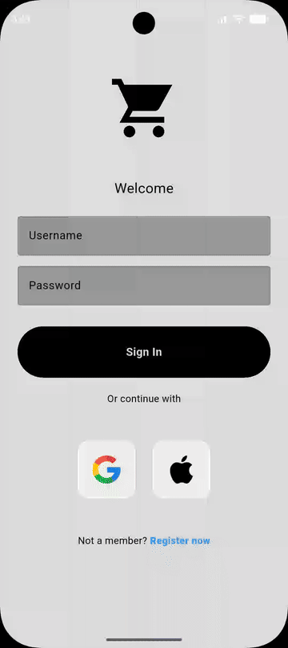

# 🛍️ ShopApp — Flutter E-Commerce App

A fully functional mobile e-commerce application built with **Flutter**, featuring user authentication, product browsing, cart management, and a credit card payment flow.

---

## 📱 Demo

<p align="center">
  
</p>

---

## 📱 Screenshots & Features

### 🔐 Authentication
- Login & Registration screens with form validation
- Guest login option (Google / Apple sign-in UI)
- User session managed via `Provider`

### 🏪 Shop
- Horizontally scrollable product sections: **Trend**, **Discount**, **Other Products**
- Product detail page with image, description, price, and rating
- Search bar with real-time filtering
- Filter bar for category selection

### 🛒 Cart
- Add / remove items with quantity management
- Live total price calculation
- Clear cart with confirmation dialog
- Animated receipt display on checkout

### 💳 Payment
- Interactive animated credit card widget (flip animation on CVV focus)
- Credit card form with real-time card preview
- Order confirmation dialog
- Delivery Progress page post-payment

### 🌙 Profile & Settings
- User profile display (name, email)
- Dark / Light mode toggle (persisted via `ThemeProvider`)
- Side drawer navigation

---

## 🛠️ Tech Stack

| Layer | Technology |
|---|---|
| Framework | Flutter 3.x |
| Language | Dart |
| State Management | Provider |
| UI Components | Material Design 3 |
| Credit Card UI | `flutter_credit_card` |
| Navigation | Named Routes |
| Localization | `intl` (date/currency formatting) |

---

## 📂 Project Structure

```
lib/
├── main.dart                   # App entry point, MultiProvider setup
├── auth/
│   ├── pages/
│   │   ├── login_page.dart         # Login screen
│   │   ├── Registration_Page.dart  # Registration screen
│   │   ├── shop_page.dart          # Main shop with product sections
│   │   ├── product_page.dart       # Product detail view
│   │   ├── cart_page.dart          # Shopping cart
│   │   ├── payment_page.dart       # Credit card checkout
│   │   ├── Delivery_Progress_Page.dart  # Post-payment receipt
│   │   └── profile_page.dart       # User profile + theme toggle
│   ├── models/
│   │   ├── product.dart        # Product data model
│   │   ├── shop.dart           # Shop state (cart logic, receipt)
│   │   └── user_provider.dart  # User session state
│   ├── components/
│   │   ├── my_product_tile.dart    # Product card widget
│   │   ├── my_cart_tile.dart       # Cart item widget
│   │   ├── my_drawer.dart          # Side navigation drawer
│   │   ├── search_bar.dart         # Search & filter component
│   │   └── ...                     # Other reusable widgets
│   └── themes/
│       ├── light_mode.dart         # Light theme definition
│       ├── dark_mode.dart          # Dark theme definition
│       └── theme_provider.dart     # Theme state management
```

---

## 🚀 Getting Started

### Prerequisites
- Flutter SDK `>=3.3.4`
- Dart SDK `>=3.3.4`
- Android Studio / Xcode (for emulator)

### Installation

```bash
# 1. Clone the repo
git clone https://github.com/KostasNikP/cvv-app.git
cd cvv-app

# 2. Install dependencies
flutter pub get

# 3. Run the app
flutter run
```

---

## 📦 Dependencies

```yaml
provider: ^6.1.2           # State management
flutter_credit_card: ^4.0.1 # Animated credit card widget
flutter_rating_bar: ^4.0.1  # Product star ratings
google_nav_bar: ^5.0.6      # Bottom navigation
intl: ^0.19.0               # Date & currency formatting
filter_list: ^1.0.2         # Category filtering
cupertino_icons: ^1.0.6     # iOS-style icons
```

---

## 🔮 Planned Improvements

- [ ] Firebase Authentication (real login/register)
- [ ] Firestore database for dynamic products
- [ ] Favorites / Wishlist feature
- [ ] Order history page
- [ ] Push notifications for delivery updates
- [ ] Unit & widget tests

---

## 👨‍💻 Author

**Kostas Nikp**  
GitHub: [@KostasNikP](https://github.com/KostasNikP)

